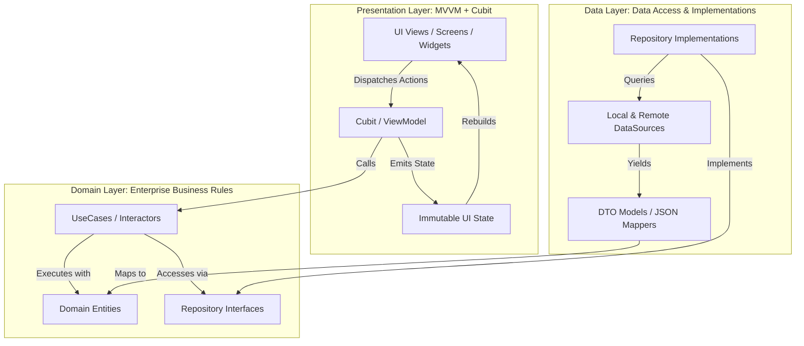

# MyCampus — Mobile Architecture & Technical Blueprint

This document specifies the software architecture, design patterns, folder structure, and technical standards applied in the **MyCampus** Flutter application for **SoftTaqwa University**.

---

## 1. Architectural Overview

The application follows **Clean Architecture** combined with **MVVM (Model-View-ViewModel)** powered by **BLoC / Cubit** in a **feature-first** modular layout.



### Key Architectural Tenets
1. **Separation of Concerns (SoC):** UI never directly accesses network, cache, or raw repository layers.
2. **Single Responsibility Principle (SRP):** Each UseCase represents one concrete business transaction (e.g., `GetNextClassUseCase`, `CalculateEligibilityUseCase`).
3. **Dependency Inversion Principle (DIP):** Presentation and Domain layers depend on abstract contracts. Implementations are injected via `get_it`.
4. **Deterministic Error Handling:** Domain operations return `Either<Failure, T>` using `dartz` to eliminate unhandled exceptions in the presentation layer.

---

## 2. Directory Structure

```text
lib/
├── app.dart                          # Root MaterialApp, MultiBlocProvider, global theme wiring
├── injection_container.dart          # Service Locator (get_it) dependency wiring
├── main.dart                         # Main entry point & platform initialization
│
├── core/                             # Cross-cutting concerns & shared foundations
│   ├── constants/
│   │   ├── app_assets.dart           # Static asset & SVG paths
│   │   ├── app_colors.dart           # SoftTaqwa emerald green, mint, background, card tints
│   │   ├── app_strings.dart          # App strings & labels
│   │   └── app_typography.dart       # Typography scale (GoogleFonts Inter)
│   ├── error/
│   │   ├── exceptions.dart           # Data source runtime exceptions
│   │   └── failures.dart             # Domain failure abstractions (Equatable)
│   ├── routes/
│   │   └── app_routes.dart           # Route definitions & router generator
│   ├── theme/
│   │   ├── app_theme.dart            # Material 3 light/dark themes
│   │   └── theme_cubit.dart          # Light/Dark mode switcher with SharedPreferences
│   ├── usecases/
│   │   └── usecase.dart              # Base UseCase<Type, Params> abstract contract
│   └── widgets/                      # Shared reusable UI primitives
│       ├── app_button.dart           # Primary CTA, outline, secondary buttons
│       ├── app_text_field.dart       # Form & search input fields
│       ├── custom_app_bar.dart       # University app bar with status badges & student avatar
│       ├── custom_bottom_nav.dart    # 5-tab bottom navigation with active indicators
│       ├── status_badge.dart         # Status indicators (In 15m, 94%, Urgent Memo)
│       └── metric_card.dart          # Reusable card containers with borders & shadows
│
└── features/                         # Feature-first modules
    ├── navigation/                   # Root shell holding the 5-tab BottomNavigationBar
    ├── dashboard/                    # Screen 1: Dashboard (Hero, Next Class, 8 Quick Actions, Hackathon)
    │   ├── data/
    │   │   ├── datasources/
    │   │   ├── models/
    │   │   └── repositories/
    │   ├── domain/
    │   │   ├── entities/
    │   │   ├── repositories/
    │   │   └── usecases/
    │   └── presentation/
    │       ├── cubit/
    │       ├── pages/
    │       └── widgets/
    ├── routine/                      # Screen 2: Class Routine & live lecture timeline
    ├── attendance/                   # Screen 3: 89% circular gauge, risk levels & QR scanner
    ├── profile/                      # Screen 4: PVC Digital ID, Barcode/QR, Biometrics & NFC
    ├── assignments/                  # Assignment deliverables & submission states
    ├── academics/                    # CGPA line chart & predictive grade slider
    ├── auth/                         # Student SSO login & Biometrics prompt
    ├── notices/                      # Campus circulars feed & PDF download simulator
    ├── events/                       # Campus events & active digital ticket
    ├── messaging/                    # Academic messaging channels & live office hours
    └── services/                     # Campus services directory & digital card wallet
```

---

## 3. Layer Breakdown & Contracts

### A. Domain Layer (Pure Dart)
* **Entities:** Plain Dart classes extending `Equatable` containing enterprise data.
* **Repositories (Contracts):** Abstract classes specifying data operations.
* **UseCases:** Callable classes implementing:
  ```dart
  abstract class UseCase<Type, Params> {
    Future<Either<Failure, Type>> call(Params params);
  }
  ```

### B. Data Layer
* **Models:** Extend Domain Entities and provide serialization (`fromJson`, `toJson`).
* **Data Sources:** Abstract contracts for remote APIs, local caches, or mock data sources.
* **Repositories (Implementations):** Coordinate between data sources, catch `Exceptions`, and return `Left(Failure)` or `Right(Data)`.

### C. Presentation Layer (MVVM + Cubit)
* **Cubit:** Manages state transitions and emits immutable states:
  * `StateInitial`
  * `StateLoading`
  * `StateLoaded<T>`
  * `StateError`
* **Widgets:** Use `BlocBuilder`, `BlocConsumer`, and `BlocListener` to reactively render based on the current Cubit state.

---

## 4. Dependency Injection (`injection_container.dart`)

All dependencies are registered centrally using `get_it`:
* **Factories:** Cubits / ViewModels (fresh instance per lifecycle or scoped provider).
* **Lazy Singletons:** UseCases, Repositories, DataSources, and external clients (`SharedPreferences`).

---

## 5. Technology Stack & Packages

| Package | Purpose |
| :--- | :--- |
| **`flutter_bloc`** | BLoC / Cubit state management. |
| **`get_it`** | Service locator for dependency injection. |
| **`dartz`** | Functional programming primitives (`Either<Failure, T>`). |
| **`equatable`** | Value equality for entities, failures, and states. |
| **`shared_preferences`** | Theme and session persistence. |
| **`google_fonts`** | Inter typography matching design guidelines. |
| **`percent_indicator`** | Circular attendance gauge (89%) and linear progress bars. |
| **`fl_chart`** | Smooth semester progression CGPA trend line chart. |
| **`qr_flutter`** | Real-time QR code generation for Student ID and Event passes. |
| **`barcode_widget`** | 1D Code-128 barcode rendering on the Student ID pass. |
| **`intl`** | Date and time formatting. |
